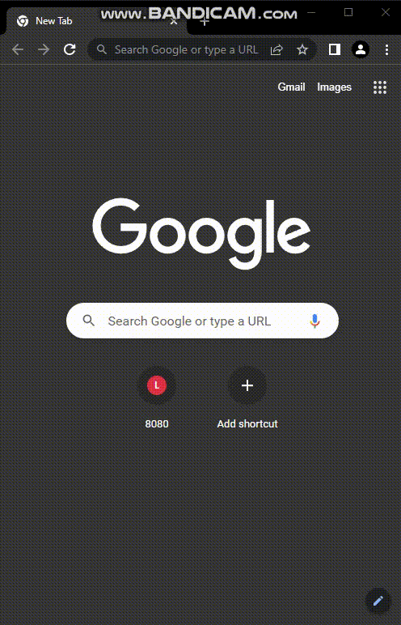

# Library web client

The application was created to automate library work, save time, money and increase the quality of service for visitors and staff.

The application allows you to work with two types of objects: people and book.

For each object are available:
- creation and saving of the person/book in the general list of objects;
- view the entire list of books and the list of people;
- viewing the personal page of each book or person;
- editing and/or deleting the current object from its page;
- linking a book to a person and deleting it from the person's page - a list of books linked to him will be displayed on the person's page.

The project uses:
- Java 11 syntax (OpenJDK 17)
- Spring Framework 2.7.2 with Tomcat 9
- SQL DB - PostgreSQL
- JDBCTemplate
- Thymeleaf
- Lombok

Basic pattern - MVC.\
The application logic is separated from the user interface while designing the software using model designs.\
Model classes store parameters for working with application objects (people and books).\
Communication with the database is carried out through DAO-classes.\
Controller classes process requests from the client and pass views to the client side.

Before start project need:
1. Connect the project to your SQL DB and configure the ***application.properties*** file (file created with PostgreSQL default parameters);
2. Run ***data.sql*** for create tables and insert new records;
3. Enter **SELECT * FROM person** and **SELECT FROM book** in SQL query console for check.

### You can check out the demo below:

***
*You can find my contacts in my profile*
